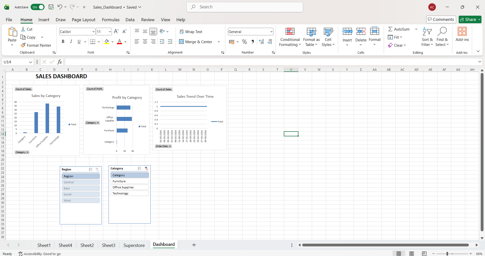

# Task 1: Sales Dashboard

## Objective

Create an interactive sales dashboard using Microsoft Excel to analyze sales performance and trends.

## Dataset

Sample Superstore Dataset

## Tools Used

* Microsoft Excel
* Pivot Tables
* Pivot Charts
* Slicers

## Features

* Sales by Category
* Profit by Category
* Sales Trend Over Time
* Region Filter
* Category Filter

## Dashboard Preview

## Outcome

Developed an interactive dashboard to visualize sales data and gain business insights using Excel.
